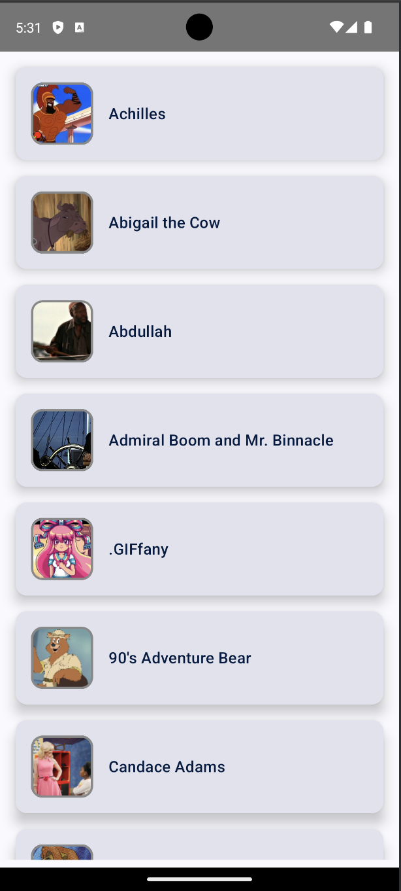
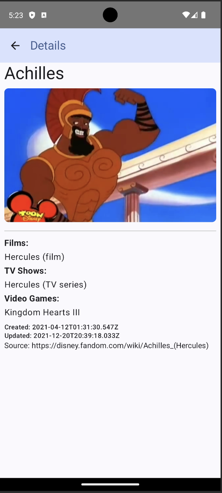

# Disney Characters Android Application

A simple Android application that displays a list of Disney characters and provides detailed information about each character.

## Features

- **Two Screens:**
  - **Character List Screen:** Displays a list of Disney characters retrieved from the [Disney API](https://api.disneyapi.dev/character).
  - **Character Detail Screen:** Shows detailed information about a selected character, including their name, image, films, and allies.
 
# Disney Characters Android Application

A simple Android application that displays a list of Disney characters and provides detailed information about each character.

## Features

- **Two Screens:**
  - **Character List Screen:** Displays a list of Disney characters retrieved from the [Disney API](https://api.disneyapi.dev/character).
  - **Character Detail Screen:** Shows detailed information about a selected character, including their name, image, films, and allies.

## Screenshots

### Character List Screen


### Character Detail Screen


## Architecture & Tools

- **Clean Architecture:** The project follows the clean architecture pattern to ensure separation of concerns and scalability.
- **Dependency Injection:** Hilt is used for injecting dependencies throughout the application.
- **Jetpack Compose:** The UI is built entirely using Jetpack Compose for a modern and reactive user interface.
- **Kotlin Coroutines:** For managing background tasks such as network requests.

## Setup Instructions

1. Clone the repository:
    ```bash
    git clone https://github.com/muco-j98/disney-app.git
    ```
2. Open the project in Android Studio.
3. Build and run the project.

## API

The app uses the [Disney API](https://api.disneyapi.dev/character) to fetch character data.


## License

This project is licensed under the MIT License - see the [LICENSE](LICENSE) file for details.


## License

This project is licensed under the MIT License - see the [LICENSE](LICENSE) file for details.
